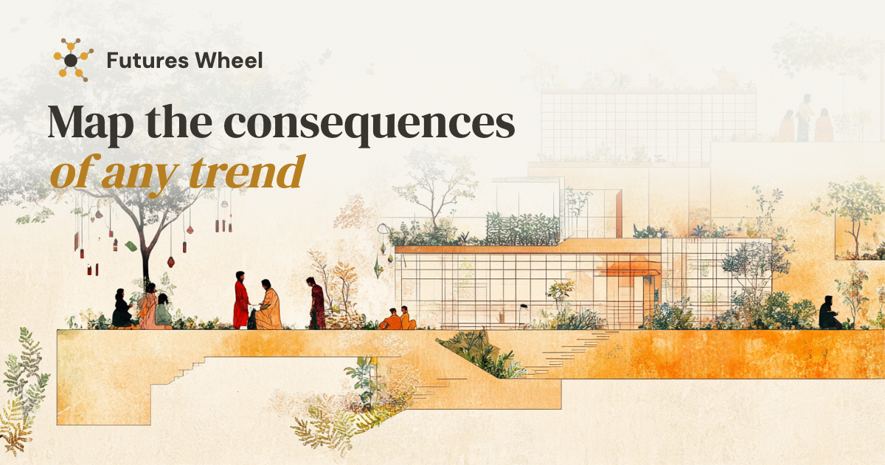

# Futures Wheel

**Map the consequences of any trend.**

Live at [welearnwegrow.github.io/futureswheel](https://welearnwegrow.github.io/futureswheel/)



## What it is and who it's for

Futures Wheel is a free thinking tool for people working on change: educators, community organisers, parents, students, policymakers and researchers.

You type in a trend and where you are noticing it. The tool draws a wheel of what that trend could lead to, and what those things lead to in turn. Each consequence is coloured by the part of life it touches, using STEEPLE: Social, Technological, Economic, Environmental, Political, Legal and Ethical. Green boxes are broadly positive, red boxes broadly negative.

It is meant to start a conversation, not to give answers. Claude suggests the consequences. You decide which ones matter.

## How to use it

1. **Name the trend.** One line is enough, for example "AI tutors replace teachers".
2. **Say where you are noticing it.** For example "government schools in rural Karnataka". The map is drawn for that place and the people in it.
3. **Press Map consequences.** The first ring shows the direct effects.
4. **Click a first-ring consequence** to see what it leads to, up to three rings out. Hover over any box to read why it happens. Scroll or pinch to zoom, and drag to move around.
5. **Press Generate report.** You will be asked for your name and email the first time. The report gives key insights over the short term (0–10 years), medium term (10–25 years) and long term (25+ years), and the themes that come up, with possibilities for intervention and risks to watch.
6. **Download the report as a PDF.** It opens in a new tab, ready to save.

## How it works

The site is two static pages hosted on GitHub Pages:

- `index.html`: the Futures Wheel tool
- `privacy.html`: the privacy page and deletion request form

Behind them, a small **Cloudflare Worker** does three jobs, so that no secret keys ever sit in the page:

- **`/`**: passes prompts to **Claude** (Anthropic's API) and returns the text that draws the map and writes the report.
- **`/lead`**: saves name, email, trend, place and date to a private **Notion** database when someone generates a report.
- **`/contact`**: saves deletion requests from the privacy page to the same Notion database, marked `DELETE EMAIL`.

The Worker only accepts requests from `https://welearnwegrow.github.io`. The Anthropic API key and the Notion token are stored as Cloudflare secrets.

### Files

```
index.html              the tool
privacy.html            privacy page
site.webmanifest        home-screen install settings (Android)
icons/favicon.svg       browser tab icon
icons/favicon-32.png    browser tab icon (fallback)
icons/apple-touch-icon.png   iPhone and iPad home-screen icon
icons/icon-192.png      Android home-screen icon
icons/icon-512.png      Android splash and install icon
icons/icon-maskable-512.png  Android adaptive icon
icons/og-image.png      social share image (1200×630)
README.md               this file
```

## Privacy summary

- We collect **name and email** only when you generate a report, stored with the trend you mapped, the place you noticed it and the date.
- Claude receives the trend and the place, **not** your name or email.
- Your browser remembers your name and email so you do not have to type them again.
- We do not sell your details, show ads, or use tracking cookies.
- You can ask for your details to be deleted at any time using the form on the [privacy page](https://welearnwegrow.github.io/futureswheel/privacy.html).

## Credits and licence

- The futures wheel method was created by Jerome Glenn in 1971. For an introduction, see [Futures Thinking Now: Futures Wheels](https://knowledgeworks.org/resources/futures-thinking-now-futures-wheels/) by KnowledgeWorks.
- Adapted from [Futurescape](https://futurescape.futurity.science/) for educational use.
- Consequences and reports are drafted by [Claude](https://www.anthropic.com/claude), made by Anthropic.
- Illustration generated with Midjourney.
- Made by [We Learn, We Grow](https://welearnwegrow.bio).

Licensed [CC BY-NC-ND 4.0](https://creativecommons.org/licenses/by-nc-nd/4.0/). · 2026 We Learn, We Grow. You may share this work with credit, for non-commercial purposes, without changes.
